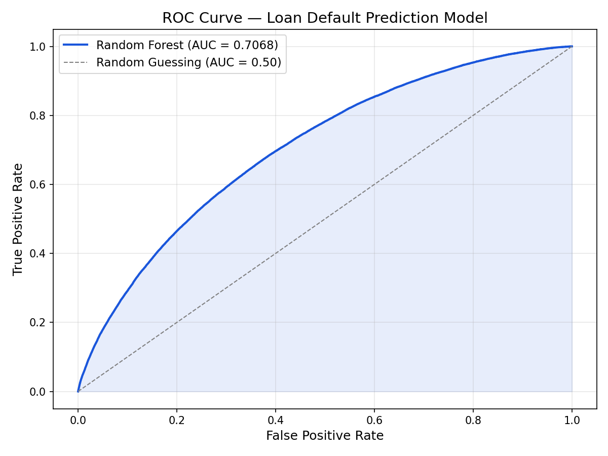
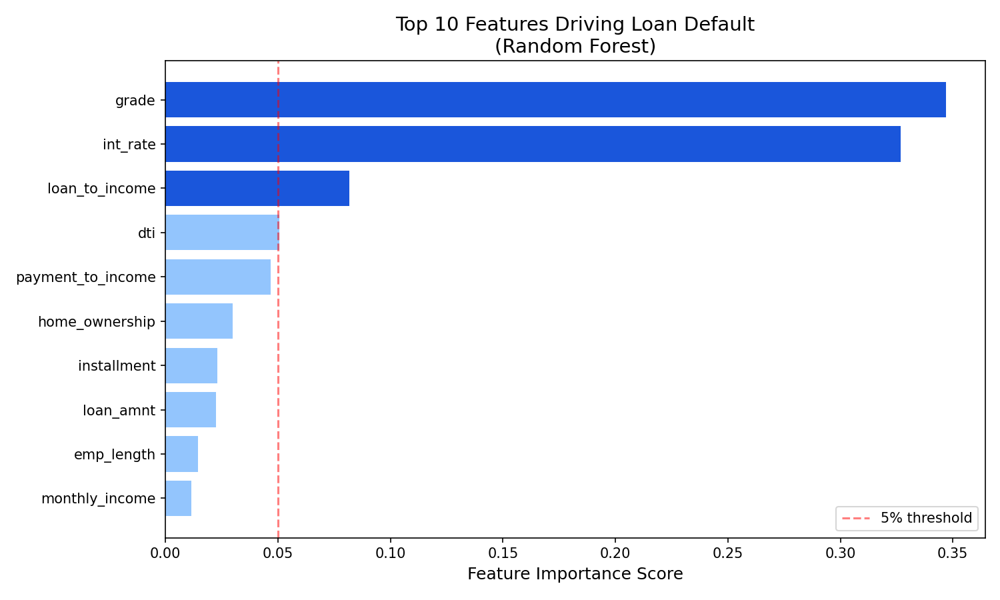

**🏦 Bank Loan Default Risk Predictor**

## 📌 Project Overview

Banks lose billions of dollars every year from loan defaults. This project builds a complete end-to-end machine learning system that predicts which loan applications are likely to default — before they are approved.

This is exactly how real bank credit risk departments operate. The system processes 1.3 million real loan records, trains a Random Forest classifier, identifies high risk borrowers and visualizes everything in an interactive Power BI dashboard.

**🎯 Business Problem**

> "Given a loan application with the borrower's financial profile, predict whether this loan will default or be fully repaid."
> 
This is a binary classification problem:
 **0** = Fully Paid ✅
 **1** = Charged Off (Default) ❌

## 📊 Dataset

Source: Lending Club (Kaggle) 
Raw Size: 2,260,701 rows 
After Cleaning: 1,342,606 rows 
Period: 2007 to 2018 
Features Used: 17 core features

**Download Dataset:**
[Lending Club Dataset on Kaggle](https://www.kaggle.com/datasets/wordsforthewise/lending-club)

**🤖 Machine Learning Results**

| Metric | Score |
|--------|-------|
| **ROC-AUC Score** | **0.7068** |
| Accuracy | 80.03% |
| Precision | 0.62 |
| Recall | 0.42 |
| F1 Score | 0.50 |

### Model Comparison
| Model | ROC-AUC |
|-------|---------|
| Logistic Regression (baseline) | 0.6998 |
| **Random Forest (final model)** | **0.7068** |

**🔍 Key Business Findings**

### 1. Loan Grade is the Strongest Predictor
| Grade | Default Rate | Avg Interest | Avg Loan |
|-------|-------------|--------------|----------|
| A | 6.05% | 7.11% | $13,869 |
| B | 13.39% | 10.68% | $13,220 |
| C | 22.45% | 14.02% | $14,173 |
| D | 30.39% | 17.72% | $15,260 |
| E | 38.50% | 21.13% | $17,606 |
| F | 45.22% | 24.93% | $19,081 |
| **G** | **49.97%** | **27.72%** | **$20,571** |

> Grade G loans default nearly 1 in 2 times —
> yet borrowers still receive up to $20,571!

### 2. Interest Rate Drives Default
| Rate Bucket | Default Rate |
|-------------|-------------|
| Below 8% | 5.2% |
| 8 to 12% | 11.8% |
| 12 to 16% | 20.3% |
| 16 to 20% | 29.7% |
| 20 to 25% | 37.4% |
| Above 25% | 48.1% |

### 3. Feature Importance (Top 5)
| Rank | Feature | Importance |
|------|---------|------------|
| 1 | grade | 34.69% |
| 2 | int_rate | 32.67% |
| 3 | loan_to_income ⭐ | 8.17% |
| 4 | dti | 5.05% |
| 5 | payment_to_income ⭐ | 4.68% |

> ⭐ = engineered features created during cleaning.
> Both ranked higher than raw financial features.

### 4. Risk Tier Distribution
| Risk Tier | Loans | % of Total |
|-----------|-------|------------|
| Low Risk | 53,380 | 19.9% |
| Medium Risk | 166,233 | 61.9% |
| High Risk | 45,493 | 16.9% |
| Very High Risk | 3,416 | 1.3% |

> 3,416 Very High Risk loans × $15K avg = **$51M**
> in potential losses identified and flagged.

---

**💰 Business Impact**

| Impact | Value |
|--------|-------|
| Defaults Caught | 22,849 loans |
| Avg Loan Amount | $14,821 |
| Money Protected | $338M+ |
| High Risk Flagged | 48,909 loans |
| Very High Risk | 3,416 loans |

**📁 Project Structure**
loan-default-risk-predictor/
│
├── loan_exploration.py       # Step 1: EDA on raw data
├── loan_cleaning.py          # Step 2: Clean 2.26M rows
├── load_to_mysql.py          # Step 3: Load to MySQL DB
├── loan_model.py             # Step 4: Train ML models
├── loan_evaluation.py        # Step 5: Evaluate + export
├── fix_rate_order.py         # Fix: Power BI sort order
│
├── powerbi_grade_summary.csv # Grade level aggregations
├── powerbi_rate_summary.csv  # Interest rate aggregations
├── powerbi_risk_summary.csv  # Risk tier aggregations
├── grade_summary.csv         # Grade analysis export
│
├── roc_curve.png             # Model performance chart
├── feature_importance.png    # Top 10 features chart
│
├── Loan_Default_Risk_Dashboard.pbix  # Power BI file
└── README.md

## 🔧 Feature Engineering

Four new features were created during cleaning:

| Feature | Formula | Purpose |
|---------|---------|---------|
| loan_to_income | loan_amnt / annual_inc | Affordability ratio |
| payment_to_income | installment / monthly_income | Monthly burden |
| high_utilization | revol_util > 80 | Credit stress flag |
| credit_experience | total_acc - open_acc | Credit history depth |

## 🗄️ MySQL Database

The project creates a `loan_default` database with
a `loan_data` table containing 1,342,606 rows.

**6 SQL Queries Executed:**
1. Default rate by loan grade
2. Default rate by interest rate bucket
3. Employment length vs default rate
4. High risk borrower profiles
5. Feature gap analysis
6. Grade summary export

## 📈 Power BI Dashboard

**8 Visuals Built:**
- 4 KPI Cards (Total Loans, Default Rate, High Risk, Avg Probability)
- Donut Chart (Risk tier distribution)
- Bar Chart (Default rate by grade A→G)
- Line Chart (Default rate by interest rate)
- High Risk Loans Table (with conditional formatting)

**[View Power BI Dashboard](https://app.powerbi.com/groups/me/reports/ca8d8046-5eb1-4f95-be65-e3ca40362b6d?ctid=7335011f-1748-4902-8dee-6f4dac036859&pbi_source=linkShare)**

**🚀 How to Run**

**Prerequisites**
bash
pip install pandas numpy scikit-learn mysql-connector-python matplotlib

**Steps**
bash
# Step 1 — Explore raw data
python loan_exploration.py

# Step 2 — Clean and prepare data
python loan_cleaning.py

# Step 3 — Load into MySQL
# Update password in load_to_mysql.py first
python load_to_mysql.py

# Step 4 — Train ML model
python loan_model.py

# Step 5 — Evaluate and export
python loan_evaluation.py

**MySQL Setup**
sql
CREATE DATABASE loan_default;
USE loan_default;
Table is created automatically by load_to_mysql.py

**🛠️ Tools and Technologies**

| Category | Tools |
|----------|-------|
| Language | Python 3.14 |
| Data Processing | pandas, numpy |
| Machine Learning | scikit-learn |
| Database | MySQL 8.0 |
| Visualization | matplotlib, Power BI |
| ML Models | Random Forest, Logistic Regression |
| Dataset | Lending Club (Kaggle) |

**ROC Curve**

**Feature Importance**

** 🧠 What I Learned**

- How to process 1.3M+ rows efficiently with pandas
- Binary classification for real financial data
- Feature engineering that outperforms raw features
- Credit risk modeling used by real banks
- MySQL batch insertion for large datasets
- Power BI dashboard design for business stakeholders
- How to interpret ROC-AUC in a business contex

